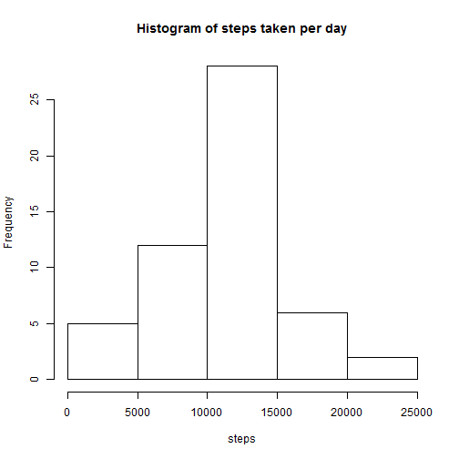
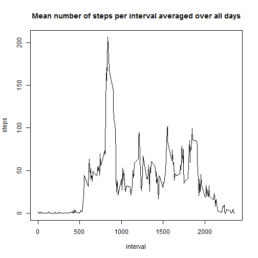
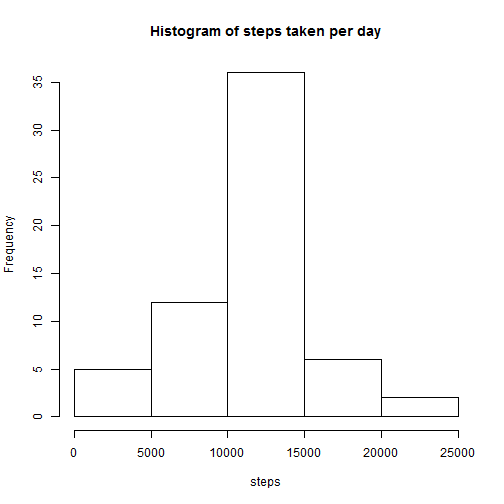
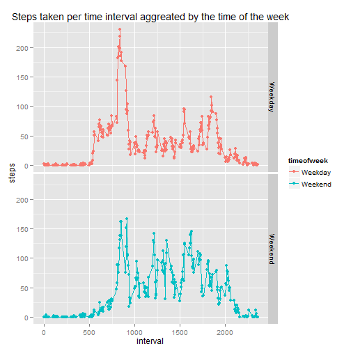

# Reproducable Research  
## Assignment 1

This document has been written to answer the questions in  peer assessment 1 of 
the reproducible research lesson in the data science specialisation offered by 
John Hopkins Bloomberg School of Puplic Health through Coursera.  

### Introduction

This assignment makes use of data from a personal activity monitoring device. This device collects data at 5 minute intervals throughout the day. The data consists of two months of data from an anonymous individual collected during the months of October and November, 2012 and include the number of steps taken in 5 minute intervals each day.


First set the working to directory to the folder that holds the unzipped activity folder

To read the csv into memory

```r
data <- read.csv("./activity/activity.csv")
```


### What is the mean total number of steps taken per day?
1. Make a histogram of the total number of steps taken each day
2. Calculate and report the mean and median total number of steps taken per day
For this part of the assignment the missing values can be ignored.

To complete this task the steps must first be sum by the aggregate of the date 
field. For this task the plyr package has been used. 

```r
require(plyr)
```

```
## Loading required package: plyr
```

```r
dailyD <- ddply(data, "date", summarise,steps = sum(steps))
```

With this completed the histogram can then be produced.

```r
with(dailyD, hist(steps, main="Histogram of steps taken per day"))
```

 

The mean can be calculated with the following formula:

```r
mean(dailyD[,"steps"], na.rm=T )
```

```
## [1] 10766
```

The median can be calculated with the following formula:

```r
median(dailyD[,"steps"], na.rm=T )
```

```
## [1] 10765
```

### What is the average daily pattern
1. Make a time series plot of the 5-minute interval (x-axis) and the average number of steps taken, averaged across all days.
2. Which 5-minute interval, on average across all the days in the dataset, contains the maximum number of steps?

Once again the plyr package will be used; this time to find the mean values aggregated against the interval column.

```r
intervalD <- ddply(data, "interval", summarise,steps = mean(steps, na.rm=T))
```

The plot can then be created.

```r
with(intervalD, plot(interval,steps, type="l", main="Mean number of steps per interval averaged over all days"))
```

 

The 5 minute interval that on average contains the maximum number of steps can then be found.

```r
intervalD[intervalD[,"steps"]== max(intervalD[,"steps"]),"interval"]
```

```
## [1] 835
```

### Input the missing values
1. Calculate and report the total number of missing values in the dataset.
2. Devise a strategy for filling in all of the missing values in the dataset.
3. Create a new dataset that is equal to the original dataset but with the missing data filled in.
4. Make a histogram of the total number of steps taken each day and Calculate and report the mean and median total number of steps taken per day. Do these values differ from the estimates from the first part of the assignment? What is the impact of imputing missing data on the estimates of the total daily number of steps?

The total number of missing values is:

```r
sum(is.na(data[,"steps"]))
```

```
## [1] 2304
```

The strategy that will be used to fill in the missing values will be to assign the mean value for the day that the interval was taken. These values where found in the previous question.  
The sqldf package will be used to help accomplish this process


```r
require(sqldf)
```

```
## Loading required package: sqldf
## Loading required package: gsubfn
## Loading required package: proto
## Loading required package: RSQLite
## Loading required package: DBI
## Loading required package: RSQLite.extfuns
```

```r
# copy data to new dataframe
filledData <- data
# find values with NA data
intList <- filledData[is.na(filledData[,"steps"]),]
# use sqldf to write the mean value of the interval per day over the NA values
filledData[is.na(filledData[,"steps"]),] <- 
    sqldf("select intervalD.steps, intList.date, intList.interval 
          from intList JOIN intervalD using(interval)")
```

```
## Loading required package: tcltk
```

To create the histogram the plyr package will again be used to sum the steps taken per day.

```r
# use the plyr package to summarise the data by date
filledDailyD <- ddply(filledData, "date", summarise,steps = sum(steps))

# create a histogram of steps per day
with(filledDailyD, hist(steps, main="Histogram of steps taken per day"))
```

 


The mean can be calculated with the following formula:

```r
mean(filledDailyD[,"steps"] )
```

```
## [1] 10766
```

The median can be calculated with the following formula:

```r
median(filledDailyD[,"steps"])
```

```
## [1] 10766
```
This shows very little change from the dataset with the missing values as filling the missing values with the mean value of the day does not add any variance to the dataso will not impact on the overall mean.

### Are there any differences in activity patterns between weekdays and weekends
1. Create a new factor variable in the dataset with two levels - "weekday" and "weekend" indicating whether a given date is a weekday or weekend day.
2. Make a panel plot containing a time series plot of the 5-minute interval and the average number of steps taken, averaged across all weekday days or weekend days.

The dataset that was created with the missing NA values filled with the mean of each day will be used to answer this question.  
First the date field will be converted from a text variab;e to a date variable.

```r
filledData[,"date"] <- as.Date(filledData[,"date"], format= "%Y-%m-%d")
```

Part of the process to add a factor variable to the dataset will need to use the function that is written below.

```r
isWeekend <- function(day)
{
    # set initial value to weekday
    retrn <- "Weekday"
   
    # if the day is Saturday or Sunday change retrn to weekend
    if(day == "Saturday" | day == "Sunday") 
    {
        retrn <- "Weekend"
    }
    # return the value of retrn
    retrn    
}
```
This function simplay takes in a text variable of a given day and returns Weekday or Weekend as necessary.

The following code can then be used to process the data into a format suitable for plotting.

```r
# use weekdays to find the day of the week of each element of date
# use sapply to send this value to isWeekend
# add the returned value of isWeekend to a new column called timeofweek
filledData[,"timeofweek"] <- as.vector(sapply(weekdays(filledData[,"date"]), isWeekend))

# convert timeofweek to a factor variable
filledData[,"timeofweek"] <- as.factor(filledData[,"timeofweek"])

# use plyr to summarise the filled data by interval and timeofweek
filledIntervalD <- ddply(filledData, .(interval, timeofweek), summarise, steps=mean(steps))
```
The plot can then be created.

```r
require(ggplot2)
```

```
## Loading required package: ggplot2
```

```r
sp <- ggplot(data=filledIntervalD, aes(x=interval, y=steps, group=timeofweek, colour=timeofweek))
sp <- sp + facet_grid(timeofweek ~ .)
sp <- sp + ggtitle("Steps taken per time interval aggreated by the time of the week")
sp <- sp + geom_line() + geom_point()
sp
```

 


